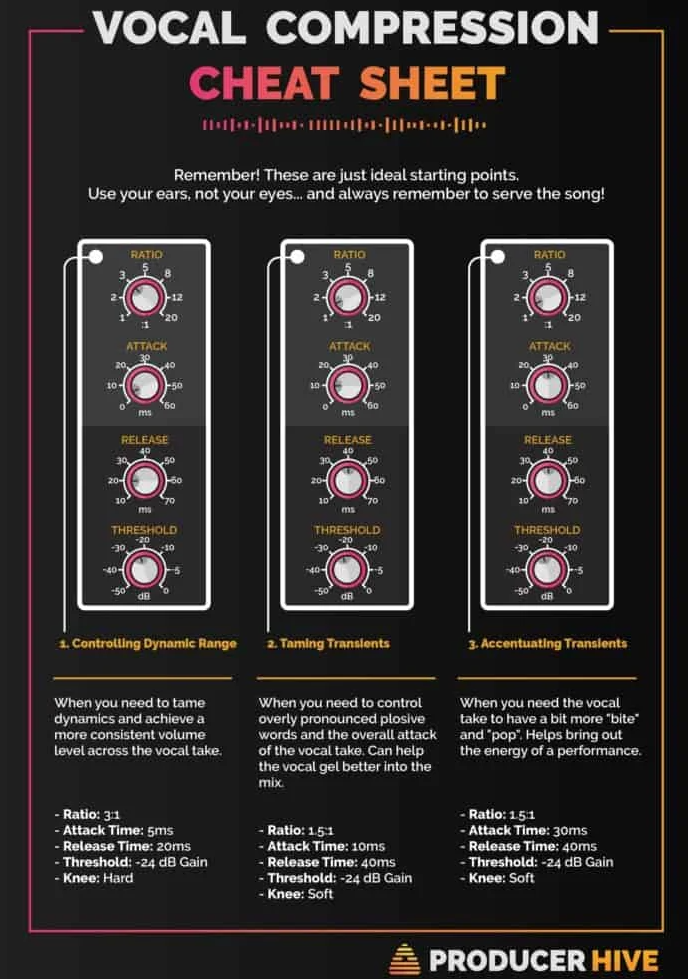

# Sound Engineer's Mixing Guide

## Compression starter settings cheat sheet

Adopted from `http://www.pcmus.com/compressors.htm`.

Sound            | Attack    | Release | Ratio      | Knee      | Gain Reduction |
---------------- | --------- | ------- | ---------- | --------- | -------------- |
Vocal            | fast      | 0.5 sec | 2:1 - 8:1  | soft      | 3 - 8 db       |
Lead Vocal       | fast      | 0.3 sec | 4:1 - 10:1 | hard      | 5 - 15 db      |
Acoustic Guitar  | 5 - 10ms  | 0.5 sec | 5:1 - 10:1 | soft/hard | 5-15 db        |
Electric Guitar  | 2 - 5 ms  | 0.5 sec | 8:1 - 10:1 | hard      | 5-15 db        |
Kick & Snare     | 1 - 3 ms  | 0.2 sec | 5:1 - 10:1 | hard      | 5-15 db        |
Bass             | 1 - 10 ms | 0.5 sec | 4:1 - 12:1 | hard      | 5-15 db        |
Mix              | fast      | 0.4 sec | 2:1 - 6:1  | soft      | 2-10 db        |
General          | fast      | 0.5 sec | 5:1        | soft      | 2-10 db        |

Adopted from `https://www.sharefaith.com/blog/2016/12/ultimate-audio-compression-guide/`.

Sound            | Attack    | Release | Ratio      | Threshold |
---------------- | --------- | ------- | ---------- | --------- |
Vocal Soft       | 0.002ms   | 38 ms   | 1.8 : 1    | -8.2 dB   |
Vocal Medium     | 0.002ms   | 38 ms   | 2.8 : 1    | -3.3 dB   |
Vocal Screamer   | 0.002ms   | 38 ms   | 3.8 : 1    | -1.1 dB   |
Snare, Kick      | 78 ms     | 300 ms  | 3.5 : 1    | -2.1 dB   |
Drums Overhead   | 27 ms     | 128 ms  | 1.3 : 1    | -13.7 dB  |
Electric Bass    | 45.7 ms   | 189 ms  | 2.6 : 1    | -4.4 dB   |
Acoustic Guitar  | 400 ms    | 400 ms  | 3.4 : 1    | -6.3 dB   |
Electric Guitar  | 26 ms     | 1127 ms | 2.4 : 1    | -0.1 dB   |
Piano            | 108 ms    | 112 ms  | 1.9 : 1    | -10.8 dB  |
Synth            | 0.002 ms  | 85 ms   | 1.8 : 1    | -11.9 dB  |
Orchestral       | 1.8 ms    | 50 ms   | 2.5 : 1    | 3.3 dB    |
Stereo Limiter   | 0.001 ms  | 98 ms   | 7.1 : 1    | 5.5 dB    |
Contour          | 0.002 ms  | 182 ms  | 1.2 : 1    | -13.4 dB  |
Squeeze          | 7.2 ms    | 127 ms  | 2.4 : 1    | -4.6 dB   |
Pump             | 1 ms      | 0.001ms | 1.9: 1     | 0 dB      |

Adopted from `https://www.dummies.com/art-center/music/recording-music/dynamic-music-compression-settings-for-stringed-instruments/`

Sound            | Attack       | Release    | Ratio        | Threshold | Desc   |
---------------- | ------------ | ---------- | ------------ | --------- | ------- |
Electric Guitar  | 25 - 30 ms   | 200 ms     | 2:1 - 3:1    | -1 dB     | Don't really need compression for Electric guitar. Give a little punch with this if needed. |
Electric Bass    | 40 - 50 ms   | 180 ms     | 2.5:1 - 3:1  | -4 dB     |
Acoustic Guitar  | 150 ms       | 400 ms     | 3:1 - 4:1    | -6 dB     | Don't really need compressor. Release is high for sustain. |
Banjo            | 40 - 50 ms   | 180 ms     | 2.5:1 - 3:1  | -6 dB     | Acoustic instrument with less sustain can have faster release. |
Classical Strings| 40 - 50 ms   | 100 ms     | 2:1 - 3:1    | -4 dB     | Adding compression to string instruments played with a bow not really necessary. If it plucked this brings it up a bit. |
Acoustic Bass    | 40 - 50 ms   | 200 ms     | 5:1 - 8:1    | -6 dB     |

## EQ starter settings cheat sheet

### Examples

Sound            | EQ Settings                          | Notes   |
---------------- | ------------------------------------ | ------- |
Kick             | -6 @ 400Hz, +4 @ 5kHz                | Reduces box quality and increases attack. |
Snare            | +4 @ 7kHz, +2 @ 100Hz                | Increases snap and adds fullness to high-tuned snare. |
Other Drums      | -4 @ 400Hz, +4 @ 15kHz               | Decreases ambiance and increases bass clarity while increasing cymbal sizzle. |
Bass             | -2 @ 50Hz, +4 @ 400Hz, +2 @ 1.5Hz    | Increase clarity of bass. Adds clarity to bass line and recognition at low volume. Increases pluck and recognition. |
Guitar           | -4 @ 100Hz, +2 @ 3kHz                | Increases guitar vs. bass distinction and increases attack. |
Keyboards        | +4 @ 5kHz                            | Increases clarity and brightness. |
Lead Vocal       | +4 @ 10kHz, +2 @ 5kHz, -2/-4 @ 200Hz | Brightens and adds presence. At 200 Hz, reduce 2 or 4 to add clarity to low vocals or increase 2 or 4 to fill out high vocals. |
Backing Vocal    | -6 @ 5kHz                            | Sets background back and increases lead vs background distinction. |

### EQ Techniques

1. Boosting Harmonic Frequencies.

It increases clarity and distinction on instruments.

2. Boosting Fundamental Frequencies.

If an instrument sounds too thin because the mic is not placed well or harmonics are over-boosted with EQ, fundamental frequencies can be boosted. However, this should be the last resort. It usually makes the instrument indistinct and muddy sounding.

3. Reducing Fundamental Frequencies

Reducing fundamental frequencies in an instrument tends to accent all of the harmonics and is a good alternative to boosting harmonics. This method is most often used in rock settings but works well for all styles of music.

Sound            | EQ Settings                          | Notes   |
---------------- | ------------------------------------ | ------- |
Bass             | 34.4 Hz | Reduce to decrease "boom" and increase recognition. |
Guitar | 37.1 Hz | Reduce to decrease boom and increase clarity. |
Vocal | 40 - 250 Hz | Reduce to decrease muddiness of vocals. |

4. Complimentary Equalisation

Example | Description |
------- | ----------- |
Kick vs Bass | Cut between 350 Hz and 400 Hz on the kick drum to remove the "cardboard" sound and increase the same frequency on the bass to add bass presence. |
Lead Vocal vs Backing | Cut between 3 kHz and 4 kHz on the background vocals to give them an "airy" sound and increase the same frequency on the lead vocal. |

## Octives

Every frequency range has a different result. I'm going to put down the 10 octaves of the spectrum. And give you a general description of how that sound might be described. So we start with the Octave, go into the Frequency range, then the Center frequency(s) of the octave. Go into descriptors, then the Benefits of these frequencies, and the cautions of using too much of them.

### Octave 1 - 20Hz-40Hz - Center 32Hz - (31.5, 31.25, 31)

Description: Chest, Sub-bass, Rumble, Thump

Benefits: all extremely low-frequency instruments (kick,bass, organ) that need a feel of power added.

Caution: causes rumble (cool for FX - post production)
__________________________________________________ __________

### Octave 2 - 40Hz-80Hz - Center 64Hz (63.5, 63)

Description: Bass, Full/Fat/Round Bass.

Benefits: all low-frequency instruments (kick, bass, etc.) that need more fulness.

Caution: only add to ONE instrument, otherwise you will lose the definition in the low end.
__________________________________________________ __________

### Octave 3 - 80Hz-160Hz - Center 125Hz

Description: Full, Fat, Body, Boomy

Benefits: Piano, Low Strings, Floor tom, Snare drum Low male vox (around 100)

Caution: cut on kick drum, bass guitar (boomy)
__________________________________________________ __________

### Octave 4 - 160Hz-320Hz - Center 250Hz
Description: muddy, muffled, ****

Benefits: all mid-range instruments (including vocals) that require some **** and natural feel to the sound

Caution: use on fewer instruments in the mix, in order to keep the definition.
__________________________________________________ __________

### Octave 5 - 320Hz-640Hz - Center 500Hz

Description: horn-like, boxy, honky, tubey, raspy

Benefits: when cut, it will make things sound more transparent. 

Attack (raspy) bass guitar.
Horns (lower brass)
- Megaphone/TV effect
- Honky-tonk piano 

Caution: kick/snare drums sound BOXY when there is too much 500Hz
__________________________________________________ __________

### Octave 6 - 640Hz-1.25kHz - Center 1kHz (actual center of the frequency spectrum. 1kHz is often used as the reference frequency when doing psycho-acoustic measurements)

Description: Aggressive, Attack, Distortion, Nasal

Benefits: Distorted guitar, snare, anything that 
needs more aggressive feel to it. (Screaming low vocals) 
- Telephone effect

Caution: higher pitch vocals - nasal sound
__________________________________________________ __________

### Octave 7 - 1.25kHz - 2.5kHz - Center 2kHz

Description: Crunchy, Gritty, Noisy, Grainy

Benefits - Background instruments, including BG Vox. (synths, strings, etc.)

Caution: too much of 2kHz will reduce the smoothness of a sound.
__________________________________________________ __________

### Octave 8 - 2.5kHz - 5kHz - Center 4kHz (Human Speech Recognition)

Description: Sharp, Edgy, Presence, Definition, "ouch" 

Benefits: Lead VOCALS and soloing instruments. 

Caution: too much can cause listener's fatigue
__________________________________________________ __________

### Octave 9 - 5kHz - 10kHz - Center 8kHz

Description: Metallic, Brilliant, Sizzling, Sibilance 

Benefits: all instruments with metallic parts (cymbals, hats), shakers, snare bottom, etc., sax and trumpet

Caution: causes sibilance in vocals (extremely sharp S and T sounds). String noise.
__________________________________________________ __________

### Octave 10 - 10kHz - 20kHz - Center 16kHz

Description: Bright, Airy, Open, Hissy

Benefits: all acoustic instruments, creates a feeling of openness and air.

Caution: tape (analog) hiss. Careful with samples that were taken from vinyl/tape

## Random Tips

- It usually sounds best if the EQ is placed before the reverb, not after it, because it has a great effect on the frequency response of the reverb.

- If it sounds muddy, cut some at 250kH. If it sounds honky, cut some at 500Hz.

- Cut if trying to make sounds better, boost if trying to make things sound different.

- You cannot boost somethin that's not there in the first place.

- Use a narrow Q when cutting and a wide Q for boosting.

- It's better to add a small amount at 2 frequencies than a large amount at one.

### Frequency Chart

### Vocal Comp Cheat Sheet

