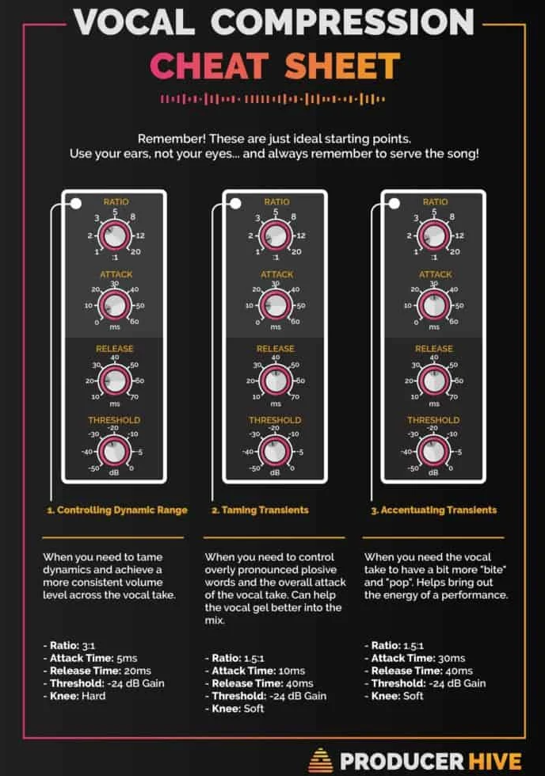

# Compression Guide

## Compression Setting

Adopted from `http://www.pcmus.com/compressors.htm`.

Sound            | Attack    | Release | Ratio      | Knee      | Gain Reduction |
---------------- | --------- | ------- | ---------- | --------- | -------------- |
Vocal            | fast      | 0.5 sec | 2:1 - 8:1  | soft      | 3 - 8 db       |
Lead Vocal       | fast      | 0.3 sec | 4:1 - 10:1 | hard      | 5 - 15 db      |
Acoustic Guitar  | 5 - 10ms  | 0.5 sec | 5:1 - 10:1 | soft/hard | 5-15 db        |
Electric Guitar  | 2 - 5 ms  | 0.5 sec | 8:1 - 10:1 | hard      | 5-15 db        |
Kick & Snare     | 1 - 3 ms  | 0.2 sec | 5:1 - 10:1 | hard      | 5-15 db        |
Bass             | 1 - 10 ms | 0.5 sec | 4:1 - 12:1 | hard      | 5-15 db        |
Mix              | fast      | 0.4 sec | 2:1 - 6:1  | soft      | 2-10 db        |
General          | fast      | 0.5 sec | 5:1        | soft      | 2-10 db        |

Adopted from `https://www.sharefaith.com/blog/2016/12/ultimate-audio-compression-guide/`.

Sound            | Attack    | Release | Ratio      | Threshold |
---------------- | --------- | ------- | ---------- | --------- |
Vocal Soft       | 0.002ms   | 38 ms   | 1.8 : 1    | -8.2 dB   |
Vocal Medium     | 0.002ms   | 38 ms   | 2.8 : 1    | -3.3 dB   |
Vocal Screamer   | 0.002ms   | 38 ms   | 3.8 : 1    | -1.1 dB   |
Snare, Kick      | 78 ms     | 300 ms  | 3.5 : 1    | -2.1 dB   |
Drums Overhead   | 27 ms     | 128 ms  | 1.3 : 1    | -13.7 dB  |
Electric Bass    | 45.7 ms   | 189 ms  | 2.6 : 1    | -4.4 dB   |
Acoustic Guitar  | 400 ms    | 400 ms  | 3.4 : 1    | -6.3 dB   |
Electric Guitar  | 26 ms     | 1127 ms | 2.4 : 1    | -0.1 dB   |
Piano            | 108 ms    | 112 ms  | 1.9 : 1    | -10.8 dB  |
Synth            | 0.002 ms  | 85 ms   | 1.8 : 1    | -11.9 dB  |
Orchestral       | 1.8 ms    | 50 ms   | 2.5 : 1    | 3.3 dB    |
Stereo Limiter   | 0.001 ms  | 98 ms   | 7.1 : 1    | 5.5 dB    |
Contour          | 0.002 ms  | 182 ms  | 1.2 : 1    | -13.4 dB  |
Squeeze          | 7.2 ms    | 127 ms  | 2.4 : 1    | -4.6 dB   |
Pump             | 1 ms      | 0.001ms | 1.9: 1     | 0 dB      |

**Descriptions**

**Vocal Soft:** This is an easy compression with a low ratio setting for ballads, allowing a wider dynamic range. It’s good for live use. This setting helps the vocal “sit in the track.”

**Vocal Medium:** This setting has more limiting than the Soft compression setting, producing a narrower dynamic range. It moves the vocal more up front in the mix.

**Vocal Screamer:** This setting is for loud vocals. It is a fairly hard compression setting for a vocalist who is on and off the microphone a lot. It puts the voice “in your face.”

**Snare, Kick:** This setting allows the first transient through and compresses the rest of the signal, giving a hard “snap” up front and a longer release.

**Drums Overhead:** The low ratio and threshold in this setting gives a “fat” contour to even out the sound from overhead drum mics. Low end is increased, and the overall sound is more present and less ambient. You get more “boom” and less “room.”

**Electric Bass:** The fast attack and slow release in this setting will tighten up the electric bass and give you control for a more consistent level.

**Acoustic Guitar:** This setting accentuates the attack of the acoustic guitar and helps maintain an even signal level, keeping the acoustic guitar from disappearing in the track.

**Electric Guitar:** This is a setting for “crunch” electric rhythm guitar. A slow attack helps to get the electric rhythm guitar “up close and personal” and gives punch to your crunch.

**Piano:** This is a special setting for an even level across the keyboard. It is designed to help even up the top and bottom of an acoustic piano. In other words, it helps the left hand to be heard along with the right hand.

**Synth:** The fast attack and release on this setting can be used for synthesizer horn stabs or for bass lines played on a synthesizer.

**Orchestral:** Use this setting for string pads and other types of synthesized orchestra parts. It will decrease the overall dynamic range for easier placement in the mix.

**Stereo Limiter:** Just as the name implies, this is a hard limiter (or “brickwall”) setting—ideal for controlling the level to a two-track mixdown deck or stereo output.

**Contour:** This setting fattens up the main mix.

**Squeeze:** This is dynamic compression for solo work, especially electric guitar. It gives you that glassy “Tele/Strat” sound. It is a true classic.

**Pump:** This is a setting for making the compressor “pump” in a desirable way. This effect is good for snare drums to increase the length of the transient by bringing the signal up after the initial spike.

## Compression Vocal Cheatsheet

</img>

## Compression on string instruments

Adopted from `https://www.dummies.com/art-center/music/recording-music/dynamic-music-compression-settings-for-stringed-instruments/`

- Electric Guitar

Threshold: –1dB

Ratio: 2:1–3:1

Attack: 25–30 ms

Release: About 200 ms

Gain: Adjust so that the output level matches the input level. You don’t need much added gain.

Generally, electric guitar sounds are pretty compressed. You don’t need additional compression when you track the guitar unless you use a clean (undistorted) setting on your guitar. If you want to use a little compression to bring the guitar forward and give it some punch, try these settings above.

The slow attack is what gives the guitar a bit of punch. If you want less punchiness, just shorten the attack slightly. Be careful though, because if you shorten it too much, you end up with a mushy sound. (Sorry . . . ahem . . . the guitar has no definition.)

- Electric Bass

Threshold: –4dB

Ratio: 2.5:1–3:1

Attack: 40–50 ms

Release: About 180 ms

Gain: Adjust so that the output level matches the input level. You don’t need much added gain.

Another way to get a handle on the potential muddiness of the amplified bass guitar is to use a little compression. Compression can also help control uneven levels that result from overzealous or inexperienced bass players. Try these settings for a start:

- Acoustic Guitar (Strummed or picked acoustic instruments)

Threshold: –6dB

Ratio: 3:1–4:1

Attack: Around 150 ms

Release: About 400 ms

Gain: Adjust so that the output level matches the input level. You don’t need much added gain.

You don’t generally need a lot of compression on acoustic stringed instruments, especially if you want a natural sound. You can use the compressor to even out the resonance of the instrument to keep the main character of the instrument from getting lost in a mix and to avoid a muddy sound. These are good settings for strummed or picked acoustic instruments:

The release is set very high because of the amount of sustain that these acoustic instruments can have. If you play an instrument with less sustain, like a banjo, you may find that a shorter attack and release work just fine. In this case, try the following settings:

Threshold: –6dB

Ratio: 2.5:1–3:1

Attack: 40–50 ms

Release: About 180 ms

Gain: Adjust so that the output level matches the input level. You don’t need much, if any, added gain.

- Classical Strings

For the most part, adding compression to string instruments played with a bow isn’t necessary. However, you will find that using a compressor on a plucked acoustic bass and fiddle can bring them out in a mix.

A starting point for compressor settings for a fiddle would be as follows:

Threshold: –4dB

Ratio: 2:1–3:1

Attack: 40–50 ms

Release: About 100 ms

Gain: Adjust so that the output level matches the input level. You don’t need much, if any, added gain.

Try these settings for the acoustic bass:

Threshold: –6dB

Ratio: 5:1–8:1

Attack: 40–50 ms

Release: About 200 ms

Gain: Adjust so that the output level matches the input level. You need a bit of added gain here.

# Tips

from `https://flypaper.soundfly.com/produce/how-to-choose-compressor-settings/`

Common compression mistakes
One of the most glaring signs that a track has been mixed by an inexperienced engineer is the improper use of compression. Here are a few mistakes to avoid as you explore and experiment with your compressor settings.

1. Attack set too fast on drums/percussion
You might be tempted to stylishly slam the percussive elements of your mix with your favorite compressor. But you really can have too much of a good thing. If the attack time is set too fast, you’ll simply be reducing the “impact” of the individual drum hits by squeezing the initial moments of the sounds too hard.

It’s easy to think faster attack settings sound better when the drums are soloed, but in the context of the track, the drums will disappear if the the transients have been limited too aggressively. Percussion hits are meant to be dynamic, so let them be!

- 10 compression mistakes that will destroy your mixes: `https://www.tunecore.com/blog/2018/12/10-compression-mistakes-that-will-destroy-your-mixes.html`
